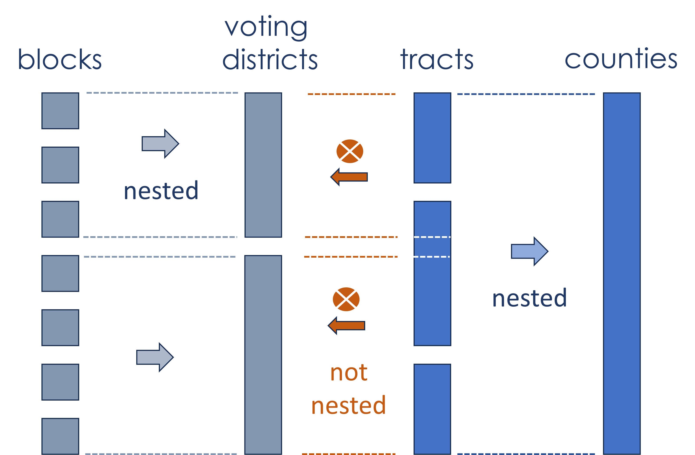
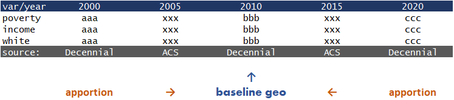

# The geocrosswalk R Package

This package allows researchers to easily crosswalk their data from one geographic designation and time period to another. 

Data can be transformed across geographic level for the same time period (e.g., census tract to census place), or transformed for the same geographic level across time (e.g. 2000 census tracts to 2010 census tracts).

Full data panels can be created by specifying the desired geographic level, desired time periods, variables from a list of the ~25 most frequently used, and the time period that will serve as the baseline. The package will then conduct cross-time apportionment and geolevel conversions to generate a longitudinal dataset covering the specified period with data harmonized to the desired baseline year.

The package simplifies the process using a set of pre-built assets: 

* a variable name crosswalk table for the ~25 most useful census variables  
* pre-built census tables at the block and tract levels for the specified variables all time periods (1990, 2000, 2005-today)
* a set of geographic aggregations described in the geoid crosswalks
* a set of over-time apportionment tables that allow for data coversion between time periods

 

 

### Harmonizing Data Across Geographic Levels

Data available at the census block or tract levels can be aggregated up to any of the geographic levels defined in the census geoid crosswalk files: 

**[from block](https://nccsdata.s3.us-east-1.amazonaws.com/geo/xwalk_geoid/block_crosswalk.csv)** (11,078,297 rows=blocks, 636 MB)
- Census Place
- Urban Areas
- Voting Districts
- ZCTAs
- NCES Locales

**[from tract](https://nccsdata.s3.us-east-1.amazonaws.com/geo/xwalk_geoid/tract_crosswalk.csv)** (74,091 rows=tracts, 15 MB) 
- Public Use Microdata Areas (PUMAs)
- Core Based Statistical Areas (CBSAs)
- Combined Statistical Areas (CSAs)
- County
- State
- Woodard's Cutural Regions
- American Communities Cultural Regions
- Census Regions
- Census Divisions

The data dictionary describing geolevels is available [HERE](geoid-crosswalk-dd.md). 

 

### Harmonize Data Across Time

Explain challenges / problems solved to generate panel: 

* data drawn from different sources (dicennial vs acs)
* variable name changes
* apportionment needed to harmonize data to single geography

**Count Apportionment**

When the unit of measurement is counts of people, households, or similar things. 

**Weighted Apportionment**

When the unit of measurement is a ratio, median, or other non-linear mathematical transformation weighted apportionment will be more accurate. 

Common features used to weight variables are things like age groups, race catgegories, sex, or levels of education. A weighted apportionment requires that variable of interest to be available in the facet version - broken out by each level of one of these categorical variables. 

Mentions methods? Current options are `ltdb`, and `nhgis` for tracts, `nhgis` and `census` for all other geographies.

 

### Geography Plus Time Conversions

If data is being converted from 2000 blocks to 2010 places there are two possible approaches: time conversion first or geolevel conversion first. 

The package harmonizes data by first apportioning values over time, then aggregating up to the appropriate geolevel. This will result in less error than the alternative approach, geolevel first then apportionment over time. 

 

 

## Core Functions

### `convert_geolevel()`

The **convert_geolevel()** function will use crosswalks available publicly to approximate data from one geolevel (in the same vintage) to another. 

> **Usage Example**: A researcher has data at the Census Tract level that they would like to transform to the Census Place level. They would be able to use this function to transform their data. The input would be data at the 2010 tract level; the output would be data approximated at the 2010 place level.

Proposed parameters are:

  - **.data**: `data.frame` or `tibble`. 
  - **.level_from**: `character`specifying the geographic designation the data is currently in. See `geocrosswalk::supported_geos` for geographic options.
  - **.level_to**: `character`specifying the geographic designation the data will be transformed to. See `geocrosswalk::supported_geos`  for geographic options.
  - **.year**: `numeric` specifying the year of the geographic boundaries. Options include `1990`, `2000`, `2010`, and `2020`. 
  - **.weight**: `character` specifying what to use to represent the size of the intersection between `.from` and `.to` geographies. Options are `population`, `land areas`, and `housing units`. 
  - **.geoid**: `character` specifying the geographic ID of the `.from` geometry.
  - **.by**: `character` variable name of any variable by which the data is long by the geographic unit. For example, if a dataset is census tracts by year, we will want to create statitistics for each year. 
  - **.count_variables**: `character` vector of variable names to adjust that represent `count` data. This represents any data that can be counted (e.g. 1 person, 2 people, ect.).
  - **.non_count_variables**: `character` vector of variable names to adjust that represent non-count data. This could represent data that is a median or average for a particular geography, or any statistic that cannot be counted. 
  - **.non_count_weights**: `character` vector of variable names that represent `count` metrics that can be used to weight the `.non_count_variables` during geographic conversion. For example, if the statistic is `median_household_income`, the `.non_count_weights` could be `total_households_reporting_income`. Vector must be in the same order as `.non_count_variables`.

 

 

### `harmonize_by_time()`

The **harmonize_by_time()** function will use crosswalks available publicly to approximate data from the same geographic level to a different year of release. 

> **Usage Example**: A researcher is doing a longitudinal analysis using data at the census tract level. The need to standardize their data over time as census tracts boundaries change. This function standardizes that data to reflect consistent boundaries over time. The input would be a census tract level dataset over time. The output would be that same dataset with standard boundaries over time.

Proposed parameters are:

- **.data**: `data.frame` or `tibble`.  
- **.geography**: `character` geographic level of data. Current options are in `geocrosswalk::standard_geos`.
- **.year_from**: `numeric` geographic vintage of the original data. Current options are 1990, 2000, 2010, and 2020. If no years or multiple years provided, will do a check to determine what vintage geoids are most likely in.
- **.year_to**: `numeric` geographic vintage of the year you are standardizing to. 
- **.geoid**: `character` specifying the geographic ID of the `.year_from` geometry.
- **.by**: `character` variable name of any variable by which the data is long by the geographic unit. For example, if a dataset is census tracts by year, we will want to create statitistics for each year. 
- **.method**: `character` used to standardize data over time. Current options are `ltdb`, and `nhgis` for tracts, `nhgis` and `census` for all other geographies.
- **.count_variables**: `character` vector of variable names to adjust that represent `count` data. This represents any data that can be counted (e.g. 1 person, 2 people, ect.).
- **.non_count_variables**: `character` vector of variable names to adjust that represent `non-count` data. This could represent data that is a median or average for a particular geography, or any statistic that cannot be counted. 
 - **.non_count_weights**: `character` vector of variable names that represent `count` metrics that can be used to weight the `non_count_variables` during geographic conversion. For example, if the statistic is `median_household_income`, the `.non_count_weight` could be `total_households_reporting_income`.

 

 

## Nice-to-have's

### `guess_vintage()`

This function will attempt to guess the geographic vintage of data.They can also check if data is a specific geographic vintage and guess the vintage by another variable (such as year).

> **Usage Example**: A researcher has data but is unclear about which geographic vintage the data is in. Will also be used internally as an input into the `standardize_time()` function.

Proposed parameters are:

- **.data**: `data.frame` or `tibble`.  
- **.geography**: `character` geographic level of data. Current options are in `geocrosswalk::standard_geos`.
- **.geoid**: `character` specifying the variable name of the geographic ID to be checked.  
- **.by**: `character` specifying the name of the variable to run this guess by (such as a year variable).
- **.is_vintage**: `numeric` optional year to test if the data is a specific geographic vintage. 

### `recommend_methodology()`

This function will attempt to recommend a methodology to standardize geographies or covert geographic levels based on the data source and geographic levels and vintages. In general, data should be collected at the smallest geography possible before standardization in order to minimize error. 

> **Usage Example**: A researcher wants standardized place data over time, but does not know exactly how to standardize such that it would minimize the most error given their options. This function would give a recommendation based on the users projected data sources (e.g. decennial census or ACS) on the geographic unit to use as the `.from` geography in this packages' core functions as well as what functions to run to standardize or convert geographies.

Proposed parameters are:

- **.level_from**: `character` of geography to convert or standardize from. 
- **.level_to**:  `character` of geography to convert or standardize to.
- **.year_from**: `character` of geography to convert or standardize from.
- **.year_to**: `character` of geography to convert or standardize to.
- **.data_sources**: `character` vector of unique data sources. Current options are "decennial" and "acs". 

### `estimate_error()`
This function will attempt to estimate the amount of error introduced by the geographic approximation in the final estimate. Nested geographies in generally will have very little error; geographies where intersections are split will have more error.

> **Usage Example**: A user is attempting to ascertain how much error a specific geographic transformation will introduce in their estimates.

- **.level_from**: `character` of geography to convert or standardize from. 
- **.level_to**:  `character` of geography to convert or standardize to.
- **.year_from**: `character` of geography to convert or standardize from.
- **.year_to**: `character` of geography to convert or standardize to.
- **.geoid**: `character` specifying the geographic ID of the `.from` geometry. 
- **.method**: `character` used to standardize data over time. Current options are `ltdb`, and `nhgis` for tracts, `nhgis` and `census` for all other geographies.

### `join_report()`
This function will report on the join between the `.from` or `.year_from` geographies and the relevant crosswalk.  

> **Usage Example**: A user would like to ascertain which geographic units would merge with the relevant crosswalk and which would not prior to using `convert_level()` or `standardize_time()`. If `.level_from` and `.level_to` are different, `.year_from` and `.year_to` cannot be different, and vice versa.  

- **.data**: `data.frame` or `tibble`.
- **.level_from**: `character` of geography to convert or standardize from. 
- **.level_to**:  `character` of geography to convert or standardize to.
- **.year_from**: `character` of geography to convert or standardize from.
- **.year_to**: `character` of geography to convert or standardize to.
- **.geoid**: `character` specifying the geographic ID of the `.from` geometry. 
- **.method**: `character` used to standardize data over time. Current options are `ltdb`, and `nhgis` for tracts, `nhgis` and `census` for all other geographies.

## Proposed Features

**validate_vintage() function** 
samples a couple dozen observations from the dataset for variable_x and compare to values returned from the API for the given geoids to confirm that the year produced by 
guess_vintage() is correct

**coverage_report() function** 

give a geolevel, time period, and set of variable names and get a report on data coverage.

| **VAR**      | **2000** | **2001** | **2002** | **2003** | **2004** | **2005** | **2006** | **2007** | **2008** |
|:-------------:|:--------:|:--------:|:--------:|:--------:|:--------:|:--------:|:--------:|:--------:|:--------:|
| **pop**       | X        | X        | X        | X        | X        | X        | X        | X        | X        |
| **pov**       | X        | .        | .        | .        | .        | X        | X        | X        | X        |
| **unempl**    | X        | .        | .        | .        | .        | X        | X        | X        | X        | 

