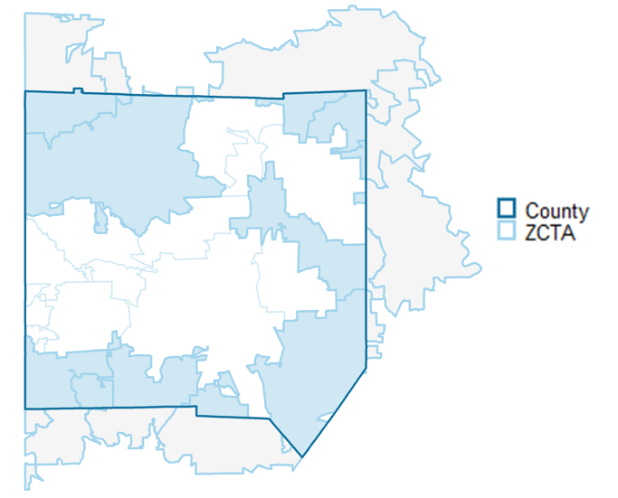
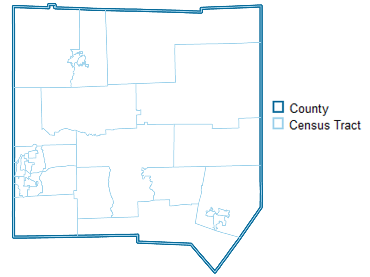

# The geocrosswalk R Package

This package allows researchers to easily crosswalk their data from one geographic designation and time period to another. 

Data can be transformed across geographic level for the same time period (e.g., census tract to census place), or transformed for the same geographic level across time (e.g. 2000 census tracts to 2010 census tracts).

Pre-built Census data panels with data harmonized over time can be accessed by specifying the desired geographic level, desired time periods, variables from a list of the ~25 most frequently used, and the geographic vintage to harmonize to. The package will then return a longitudinal dataset covering the specified period with data harmonized to the desired geographic vintage. 

The package simplifies the process using a set of pre-built assets: 

* geographic level crosswalk files generated from Missouri Census Data Center's Geocorr tool
* a set of over-time apportionment tables that allow for data conversion between time periods from IPUMS NHGIS and the Census Bureau
* a variable name crosswalk table for the ~25 most useful census variables  
* pre-built census tables at the block level (decennial) and block group level (5-year American Community Survey) 
* geographic level crosswalk for nested geographies at the census block and census tract levels 

 

 

## Converting Data Across Geographic Levels

To convert data across geographic levels (e.g.; census tracts to census PUMAs), we need a geographic crosswalk. These crosswalks allow us to approximate data from one geographic level to another. 

### Non-nested Geographies
Non-nested geographies are geographies that do not align spatially even upon aggregation. 

To approximate data at another geographic level using non-nested geographies, we need a **weight** that represents the portion of the original geography that intersects with the target geography. 
We gather crosswalks with these weights from Missouri Census Data Center's Geocorr tool. 

Generally, when using geographic crosswalks for geographies that *do not nest*, it is better to start with the smallest possible geographic unit of observation available. This is to reduce the amount of error created by splitting up the original data into parts.

### Nested Geographies
Data that is nested are easier to aggregate as data are fully encompassed within one geography, without splitting the original geography.

Data available at the census block or tract levels can be aggregated up to any of the geographic levels defined below in the nested crosswalk files. Note that these crosswalk files are especially helpful if you have data at the block or tract level already and would like to crosswalk to multiple geographic entities.  

**[from block](https://nccsdata.s3.us-east-1.amazonaws.com/geo/xwalk_geoid/block_crosswalk.csv)** (11,078,297 rows=blocks, 636 MB)
- Census Place
- Urban Areas
- Voting Districts
- ZCTAs
- NCES Locales

**[from tract](https://nccsdata.s3.us-east-1.amazonaws.com/geo/xwalk_geoid/tract_crosswalk.csv)** (74,091 rows=tracts, 15 MB) 
- Public Use Microdata Areas (PUMAs)
- Core Based Statistical Areas (CBSAs)
- Combined Statistical Areas (CSAs)
- County
- State
- Woodard's Cutural Regions
- American Communities Cultural Regions
- Census Regions
- Census Divisions

The data dictionary describing geolevels is available [HERE](https://nccsdata.s3.us-east-1.amazonaws.com/geo/data/census_codebook.xlsx). Data was pulled from a variety of sources.

Note that census blocks are nested within census tracts, so blocks can be converted to any of the geographies listed above. 

 

## Harmonize Data Across Time

Geographies created by the census often change over times in terms of their geographic boundaries. This can be a challenge for researchers that would like to compare data from the same region over time.

Therefore, we need crosswalks to approximate changes in geography over time. We gather this data from IPUMS NHGIS, the Census Bureau, and the Longitudinal Tract Database. 

Generally, geographic levels that change over time are **unnested**, in that there are some original geographies that do not fit evenly into the target geographies. When using geographic crosswalks for geographies that *do not nest*, it is better to start with the smallest possible geographic unit of observation available. This is to reduce the amount of error created by splitting up the original data into parts.

Therefore, when using crosswalks to approximate Census data over time, it is better to start with the lowest geographies available for that data; for Decennial Censuses this is the block and for the American Community Survey this is the block group. 

Another challenge when harmonizing data across time for Census Decennial and American Community survey data is matching variable names over time in order to reference the same variable. We create a variable crosswalk over time for NHGIS and the Census API for the ~25 most commonly used variables in these datasets.

## Count Data

When the unit of measurement is counts of people, households, or similar things, it is much easier to convert data across geographic levels and over time. With count data, we can apportion the data by directly splitting it up into parts. 

## Non-count Data

When the unit of measurement is a ratio, median, or other non-linear mathematical transformation weighted apportionment will be more accurate. This in effect transforms the data so that it can be split into parts for the geographic transformation.

Common features used to weight variables are variables that closely resemble the population that the ratio, median, or mathemtical transportation represent. For example, if a variable is median household income, we may use the number of households that have income as the weighted variable in order to most closely allocate median household income into parts, that is then aggregated to the final geography. 

 

## Geography Plus Time Conversions

If data is being converted from 2000 blocks to 2010 places there are two possible approaches: time conversion first or geolevel conversion first. 

The package harmonizes data by first apportioning values over time, then aggregating up to the appropriate geolevel. This will result in less error than the alternative approach, geolevel first then apportionment over time. This is because it is much better to split up smaller levels of geography than bigger ones, as this will introduce less error into the geographic transformation

 

 

## Core Functions

### `convert_geolevel()`

The **convert_geolevel()** function will use crosswalks available publicly to approximate data from one geolevel (in the same vintage) to another. 

> **Usage Example**: A researcher has data at the Census Tract level that they would like to transform to the Census Place level. They would be able to use this function to transform their data. The input would be data at the 2010 tract level; the output would be data approximated at the 2010 place level.

Proposed parameters are:

  - **.data**: `data.frame` or `tibble`. 
  - **level_from**: `character`specifying the geographic designation the data is currently in. See `geocrosswalk::supported_geos` for geographic options.
  - **level_to**: `character`specifying the geographic designation the data will be transformed to. See `geocrosswalk::supported_geos`  for geographic options.
  - **.year**: `numeric` specifying the year of the geographic boundaries. Options include `1990`, `2000`, `2010`, and `2020`. 
  - **weight**: `character` specifying what to use to represent the size of the intersection between `level_from` and `level_to` geographies. Options are `population`, `land areas`, and `housing units`. 
  - **geoid**: `character` specifying the geographic ID of the `.from` geometry.
  - **.by**: `character` variable name of any variable by which the data is long by the geographic unit. For example, if a dataset is census tracts by year, we will want to create statitistics for each year. 
  - **count_variables**: `character` vector of variable names to adjust that represent `count` data. This represents any data that can be counted (e.g. 1 person, 2 people, ect.).
  - **non_count_variables**: `character` vector of variable names to adjust that represent non-count data. This could represent data that is a median or average for a particular geography, or any statistic that cannot be counted. 
  - **non_count_weights**: `character` vector of variable names that represent `count` metrics that can be used to weight the `.non_count_variables` during geographic conversion. For example, if the statistic is `median_household_income`, the `non_count_weights` could be `total_households_reporting_income`. Vector must be in the same order as `non_count_variables`.

Proposed output: `dataframe` or `tibble` of data at new geographic level

 

 

### `harmonize_by_time()`

The **harmonize_by_time()** function will use crosswalks available publicly to approximate data from the same geographic level to a different year of release. 

> **Usage Example**: A researcher is doing a longitudinal analysis using data at the census tract level. The need to standardize their data over time as census tracts boundaries change. This function standardizes that data to reflect consistent boundaries over time. The input would be a census tract level dataset over time. The output would be that same dataset with standard boundaries over time.

Proposed parameters are:

- **.data**: `data.frame` or `tibble`.  
- **geography**: `character` geographic level of data. Current options are in `geocrosswalk::standard_geos`.
- **year_from**: `numeric` geographic vintage of the original data. Current options are 1990, 2000, 2010, and 2020. If no years or multiple years provided, will do a check to determine what vintage geoids are most likely in.
- **year_to**: `numeric` geographic vintage of the year you are standardizing to. 
- **geoid**: `character` specifying the geographic ID of the `year_from` geometry.
- **.by**: `character` variable name of any variable by which the data is long by the geographic unit. For example, if a dataset is census tracts by year, we will want to create statistics for each year. 
- **method**: `character` used to standardize data over time. Current options are `ltdb`, and `nhgis` for tracts, `nhgis` and `census` for all other geographies.
- **count_variables**: `character` vector of variable names to adjust that represent `count` data. This represents any data that can be counted (e.g. 1 person, 2 people, ect.).
- **non_count_variables**: `character` vector of variable names to adjust that represent `non-count` data. This could represent data that is a median or average for a particular geography, or any statistic that cannot be counted. 
 - **non_count_weights**: `character` vector of variable names that represent `count` metrics that can be used to weight the `non_count_variables` during geographic conversion. For example, if the statistic is `median_household_income`, the `.non_count_weight` could be `total_households_reporting_income`.

Proposed output: `dataframe` or `tibble` of data harmonized to one specific geographic vintage.

 

 

## Nice-to-have's

### `guess_vintage()`

This function will attempt to guess the geographic vintage of data.They can also check if data is a specific geographic vintage and guess the vintage by another variable (such as year).

> **Usage Example**: A researcher has data but is unclear about which geographic vintage the data is in. Will also be used internally as an input into the `harmonize_by_time()` function.

Proposed parameters are:

- **.data**: `data.frame` or `tibble`.  
- **geography**: `character` geographic level of data. Current options are in `geocrosswalk::standard_geos`.
- **geoid**: `character` specifying the variable name of the geographic ID to be checked.  
- **.by**: `character` specifying the name of the variable to run this guess by (such as a year variable).
- **is_vintage**: `numeric` optional year to test if the data is a specific geographic vintage. 

Proposed output: If no `by` is specified, `numeric` value indicating best guess of the year of data. If `by` is specfied, a `data.frame` or `tibble` with the `.by` column and a second column identifying the guess of the numeric year for each `by` category. 

### `recommend_methodology()`

This function will attempt to recommend a methodology to standardize geographies or covert geographic levels based on the data source and geographic levels and vintages. In general, data should be collected at the smallest geography possible before standardization in order to minimize error. 

> **Usage Example**: A researcher wants standardized place data over time, but does not know exactly how to standardize such that it would minimize the most error given their options. This function would give a recommendation based on the users projected data sources (e.g. decennial census or ACS) on the geographic unit to use as the `.from` geography in this packages' core functions as well as what functions to run to standardize or convert geographies.

Proposed parameters are:

- **level_from**: `character` of geography to convert or standardize from. 
- **level_to**:  `character` of geography to convert or standardize to.
- **year_from**: `character` of geography to convert or standardize from.
- **year_to**: `character` of geography to convert or standardize to.
- **data_sources**: `character` vector of unique data sources. Current options are "decennial" and "acs". 

Proposed output: `character` string identifying steps to take to transform data from one geography or year to another. 

### `estimate_error()`
This function will attempt to estimate the amount of error introduced by the geographic approximation in the final estimate. Nested geographies in generally will have very little error; geographies where intersections are split will have more error.

> **Usage Example**: A user is attempting to ascertain how much error a specific geographic transformation will introduce in their estimates.

- **level_from**: `character` of geography to convert or standardize from. 
- **level_to**:  `character` of geography to convert or standardize to.
- **year_from**: `character` of geography to convert or standardize from.
- **year_to**: `character` of geography to convert or standardize to.
- **geoid**: `character` specifying the geographic ID of the `from` geometry. 
- **method**: `character` used to standardize data over time. Current options are `ltdb`, and `nhgis` for tracts, `nhgis` and `census` for all other geographies.

Proposed output: `data.frame` or `tibble` with two columns; `geoid` at the `to` geography and a numeric vector between 0 and 1 identifying the level of error introduced through the approximation. 

### `join_report()`
This function will report on the join between the `from` or `year_from` geographies and the relevant crosswalk.  

> **Usage Example**: A user would like to ascertain which geographic units would merge with the relevant crosswalk and which would not prior to using `convert_geolevel()` or `harmonize_by_time()`. If `level_from` and `level_to` are different, `year_from` and `year_to` cannot be different, and vice versa.  

- **.data**: `data.frame` or `tibble`.
- **level_from**: `character` of geography to convert or standardize from. 
- **level_to**:  `character` of geography to convert or standardize to.
- **year_from**: `character` of geography to convert or standardize from.
- **year_to**: `character` of geography to convert or standardize to.
- **.by: `character` optional specifying if report is done by a specific variable (such as year) 
- **geoid**: `character` specifying the geographic ID of the `.from` geometry. 
- **variables**: `character` optional specifying the variables to check missing values with  
- **method**: `character` used to standardize data over time. Current options are `ltdb`, and `nhgis` for tracts, `nhgis` and `census` for all other geographies.
- **collapsed**: `logical` if TRUE, returns the report at an aggregate level. If FALSE, returns the report by geoid.

Proposed output: `data.frame` or `tibble` identifying the geographies in the `level_from` column in the `year_from` geographic vintage that merged and didn't merge with the geographic crosswalk. If `variables` is specified, will also include a coverage report of missingness. If `.by` is specified, will include the report by each level of the `.by`.

### `pull_table()`
This function will provide Decennial Census and American Community Survey data for the ~25 most common census variables harmonized to a consistent geographic level over time. 

> **Usage Example**: A user wants panel data over time for commonly used census metrics, such as median household income or unemployment. This data needs to be harmonized over time so that changes over time will reflect real changes and not different geographic definitions. 

- **geography**: `character` of the desired geographic level of data. 
- **geographic_vintage**: `numeric` year of geographic boundaries to harmonize to. Current options are 2010 and 2020. 
- **variables**: `character` vector of variables to include. Default is all 25 commonly-used variables.
- **years**: `numeric` vector of years to pull ACS or Decennial Census data. If 2010 or 2020 is included, must specify the `which` parameter.
- **which**: `character` specifying which dataset to pull from for years 2010 or 2020. Options are "acs" or "decennial".
- **sumfile**: `character` specifying, if ACS data is being pulled, which type of ACS pull to use. Options are "acs1" for one-year ACS and "acs5" for 5-year ACS
- **method**: `character` used to standardize data over time. Current options are `ltdb`,`nhgis`, and `census` for tracts, `nhgis` and `census` for all other geographies.

Proposed output: `data.frame` or `tibble` of harmonized Census data over time at specified geographic level. 

## Proposed Features

**`validate_vintage()` function** 
This function samples a couple dozen observations from the decennial census or American Community Survey for a specific variable and compare to values returned from the census API for the given geoids.

**`coverage_report()` function** 

This function would report on data coverage across Decennial census and American Community Survey datasets given a geoographic level, years of data, and set of variable names.

| **VAR**      | **2000** | **2001** | **2002** | **2003** | **2004** | **2005** | **2006** | **2007** | **2008** |
|:-------------:|:--------:|:--------:|:--------:|:--------:|:--------:|:--------:|:--------:|:--------:|:--------:|
| **pop**       | X        | X        | X        | X        | X        | X        | X        | X        | X        |
| **pov**       | X        | .        | .        | .        | .        | X        | X        | X        | X        |
| **unempl**    | X        | .        | .        | .        | .        | X        | X        | X        | X        | 

